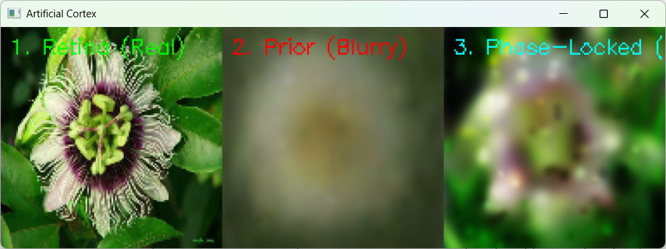
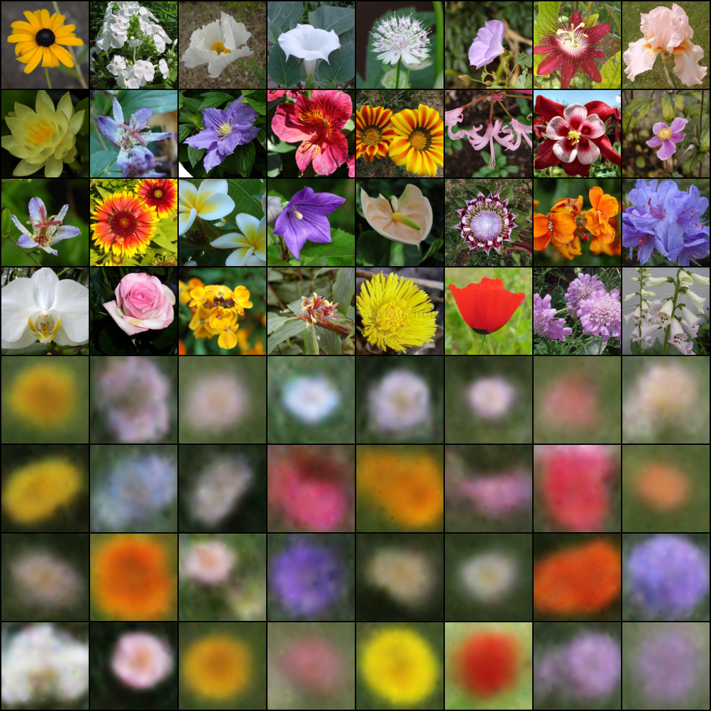

# The Splat — Live Cortex



### Train a blurry top-down prior, then give it eyes — a webcam feed forces the wave-packets to phase-lock, and you watch the gist sharpen into perception

**PerceptionLab / Antti Luode, with Claude (Opus 4.8), in dialogue with Gemini. Helsinki, June 2026.**

> Do not hype. Do not lie. Just show.

---

## What this is

`the_splat` proved an image is a sparse sum of localized Gabor wave-packets, and `splat_generator.py` trained a VAE whose decoder *is* the splatter. That generator, asked to dream a flower from a random latent, came out blurry — and that blur turned out to be the point, not the failure. A generative prior with nothing to look at has to average over everything it cannot disambiguate, so it returns the gist: low-frequency, smooth, a guess.

This is the other half of the loop. Instead of asking the prior to hallucinate detail it cannot have, we give it **bottom-up reality** and let the world supply the part the prior could not. `live_cortex_perception.py` loads the frozen VAE, points it at a webcam, and on every frame runs the predictive-coding step:

1. **Top-down prediction** — the encoder reads the frame and the decoder emits the prior's packets. On most inputs this is a blurry, often wrong, gist (panel 2).
2. **Bottom-up correction** — those packets are detached and run through a few steps of gradient descent against the *live frame*. Reality is the error signal; it pulls the packets into the structure the prior missed (panel 3).

The packets do not have to *invent* the phase, the way the generator did. The webcam supplies it, the ambiguity collapses, and the blurry prior snaps toward sharp. That is the residual-correction half of predictive coding, made live and watchable.

---

## The trained model (Hugging Face)

You do not have to train it yourself. The trained weights live on the Hub at **[`Aluode/Neuro_Splat`](https://huggingface.co/Aluode/Neuro_Splat)** (`model.pt`, trained on Oxford Flowers-102 at **image_size 128, 512 packets**). Pull it straight into `runs/splat/model.pt`:

```bash
pip install huggingface_hub
python - <<'PY'
import os, shutil
from huggingface_hub import hf_hub_download
os.makedirs("runs/splat", exist_ok=True)
src = hf_hub_download("Aluode/Neuro_Splat", "model.pt")
shutil.copy(src, "runs/splat/model.pt")
print("saved runs/splat/model.pt")
PY
```

These weights are `image_size=128, num_packets=512` — pass those flags when you run, or the `state_dict` will not load.

---

## Run it



```bash
# 1. either pull the trained model from Hugging Face (above), or train your own:
pip install torch torchvision numpy pillow
python splat_generator.py --smoke                                   # CPU sanity check first
python splat_generator.py --dataset flowers --image_size 128 --amp --beta 0.001

# 2. give it eyes (use the HF weights or your own model.pt)
pip install opencv-python
python live_cortex_perception.py --model_path runs/splat/model.pt --image_size 128 --num_packets 512
```

`--num_packets` must match the `.pt` you load (the HF model and the recommended training run are 512; the packaged generator *defaults* to 256). Route any source into the webcam slot with OBS's virtual camera to feed it images instead of a live cam, and change `cv2.VideoCapture(1)` to `(0)` if your camera is on index 0.

**The two knobs that matter**, and the tradeoff between them:

- `--lr` (default 0.2) and `--steps` (default 5) set how hard and how long reality is allowed to pull. The shipped defaults are aggressive — they sharpen fast but produce **floaters** (see below). For smoother phase-locking, calm the optimiser: `--lr 0.05 --steps 10`. More steps, gentler step size, fewer orphaned packets.

---

## What the frame shows, honestly

In the passionflower frame, the three panels are real → prior → phase-locked. The prior (panel 2) is a soft flower-coloured blob; five steps of correction (panel 3) pull it toward the real flower's petals and lighting — sharper, better-placed, still soft. That sharpening is genuine and it is the whole claim: **reality supplied the phase and the packets locked to it.**

Two honest readings have to sit next to that, because this is where it would be easy to overclaim.

**The prior here is mostly an initialisation, not a prediction.** The VAE was trained only on flowers. On a flower it is in-domain and the gist is a real head-start. On a room or a face it is the *wrong* prior — the "prediction" is a flower-shaped guess that gradient descent then overwrites. So this demo shows the **correction** half of the loop cleanly; the **prediction** half is degenerate the moment the input is not a flower. A prior that actually predicts has to be domain-general — a *temporal* next-frame prediction, not a flower generator. That is the honest next build, and it is named below.

**The floaters are an optimisation artifact, and the brain rhyme is a rhyme, not a mechanism.** Out-of-domain, with an aggressive learning rate and only a few steps, the optimiser finds that the fastest way to cut pixel error on an isolated webcam detail is to collapse a packet's envelope (`sigma`) to its minimum and crank its amplitude — orphaning it into a tiny, ultra-bright dot instead of overlapping smoothly into an edge. The result looks like **phosphenes** (the "stars" you see under mechanical or hypoxic stress on the visual cortex), and the resemblance is worth noting — but the *cause* is different. Phosphenes come from neural disinhibition; these come from an MSE optimiser with no coordination term between packets. The honest version is not "we recreated phosphenes." It is: **there is no inhibitory coupling holding the packets together, so under surprise they fire alone** — which is exactly the failure mode the inhibitory gate exists to prevent, and exactly what the `grown_gates` line (the maturing gate, the mirror gate) is about. The floaters are a pointer at the missing organ, not a trophy.

---

## The honest ledger

**Verified by running it (on your machine, your `.pt`, your webcam/OBS feed):**
- the phase-locking step sharpens the blurry prior toward the live frame — the packets lock to real structure that the prior alone did not contain (the passionflower frame shows it directly);
- the floater artifact appears and responds to the knobs exactly as the optimisation account predicts — lower `lr` and more `steps` reduce it.

**What it actually is (stated plainly):** the residual-correction half of predictive coding, with the trained VAE as the prior. On in-domain input the prior gives a real gist; off-domain it is a wrong init that the live-frame fit overwrites. The sharpening is direct gradient fitting of packets to the current frame — the single-image fit from `neuro_gabor_splat.py`, now seeded by the encoder and running live.

**Borrowed, not invented (the established neighbourhood):** predictive coding / hierarchical error correction (Rao & Ballard 1999); the free-energy principle (Friston); sparse Gabor coding of images = the V1 model (Olshausen & Field 1996); differentiable Gabor/Gaussian splatting (2023+); phosphenes and cortical disinhibition (textbook). The contribution is only the *framing and the wiring*: a blurry generative prior sharpened live by its own residual against reality, in code you can watch.

**Honest limits — read before believing it:**
- the prior is flower-only; "perception" is honest only on flowers, and is direct re-fitting elsewhere;
- there is no temporal prediction yet — each frame is corrected from scratch, so this does not yet spend less on a frame it already expected (the whole energy-on-surprise point lives in the temporal version);
- no inhibitory coordination between packets, hence the floaters; `lr`/`steps` are a crude global stand-in for that missing gate;
- relative everything; one trained model, one machine.

**The bet (untouched, as everywhere in the line):** that the phase-locked frame is a *felt* sharpening rather than a computed one — that perception is this collision experienced, not merely this subtraction performed. The demo locates the mechanism, live, in code that can fail. It does not touch the hard problem.

---

## Where it goes next

1. **Make the prior earn its name — a temporal predictor.** Replace the flower VAE's top-down guess with a next-frame prediction (the leaky hold from `the_video_tensor`, or a learned predictor), so the prior actually *predicts* the incoming frame and the packets encode only the **residual** — what moved, what the prediction missed. This is the version where the loop spends nothing on the part it already expected, joining this demo to `the_tensor`'s energy-on-surprise.
2. **Add the missing inhibition.** A coupling/overlap penalty between packets — or the `grown_gates` chandelier veto — would suppress the orphaned high-amplitude floaters by forcing packets to coordinate into edges instead of patching pixels alone. The floaters are the cleanest possible motivation for it.
3. **Depth as the next residual (the honest 3D).** Not "beat NeRF" — that is the funded-lab remake. Instead: under self-motion (camera/eye/head), the prior predicts how the scene should slide, and where that motion-prediction fails *is* depth — near things shift more than far. Structure falls out as the surprise left over when predicted flow does not match real flow. Same residual idea, one axis out, and measurable.

---

## Lineage

The perception organ of [`the_splat`](../), the live counterpart to its generator. The generator (`splat_generator.py`) is the trained top-down prior; the live cortex (`live_cortex_perception.py`) is reality forcing that prior into focus. The trained weights are on the Hub at [`Aluode/Neuro_Splat`](https://huggingface.co/Aluode/Neuro_Splat). It descends from the moiré/Gabor thread and drops into the predictive-coding loop of [`the_video_tensor`](../the_video_tensor) and [`the_anchor`](../the_anchor); the floaters point at [`grown_gates`](../) for the inhibition it lacks. The framing — that the blur was never a failure but a prior waiting for eyes — is Antti Luode's, in dialogue with Gemini; the package, the honest reading, and this document are with Claude (Opus 4.8). MIT.

*The generator dreamed a blurry flower because it had nothing to look at. Open its eyes and reality supplies the phase the dream could not; the packets lock, the gist sharpens, and what they cannot yet coordinate, they see as stars. Do not hype. Do not lie. Just show.*
