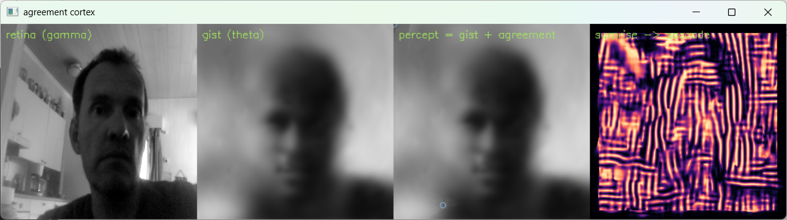
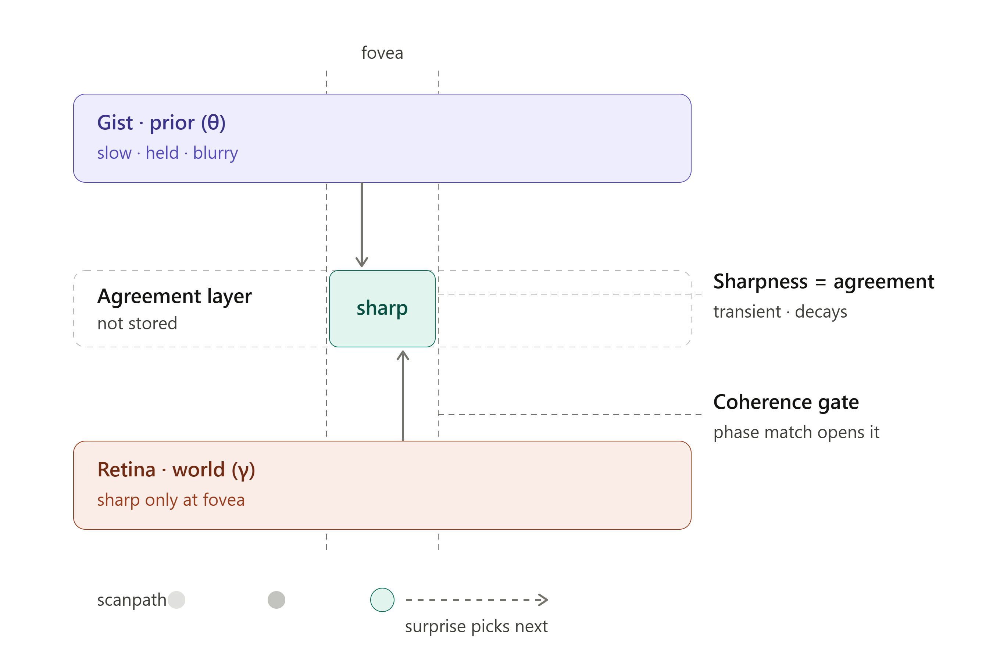

# The Agreement Layer: Foveated Saccadic Perception



This folder contains the implementation of the **Agreement Layer** architecture—a visual perception engine that models how the brain merges a slow, blurry internal world model (Theta) with high-frequency reality (Gamma) using error-driven saccades and phase-coherence gating.



## The Theory: Why This Isn't Just "Blurry Video"

Modern AI tries to render reality as a panoramic 4K image. The biological brain doesn't.

This system demonstrates how human-like visual sharpness may emerge from an active **Agreement Layer** rather than from maintaining a fully detailed internal representation of the world.

The architecture operates on three levels:

### 1. The Gist (Theta / Prior)

A persistent, low-resolution, blurry internal prediction of the world.

In this demo, it is generated by a 35 MB VAE trained on CelebA faces.

### 2. The Retina (Gamma / Reality)

The raw, sharp, high-frequency photon data arriving from the webcam.

### 3. The Agreement Layer (The Gate)

A transient mathematical mask.

Sharpness is **not stored**. When the fovea looks at a specific point, if the low-frequency prediction phase-locks with the high-frequency reality, the gate opens and sharp detail briefly appears.

When prediction fails (a phase mismatch), the system generates **Surprise**. This surprise computes the gradient of the error and drives the next **saccade**, forcing the eye to move toward the anomaly and resolve it.

---

## Required Files

To run the live perception engine, place these files in the same directory:

* `live_agreement_cortex.py` — Main execution loop and coherence-gate implementation
* `splat_generator.py` — Model architecture definition required for loading weights

---

## Installation & Dependencies

Python 3.10+ is recommended.

```bash
pip install torch torchvision numpy scipy opencv-python matplotlib
```

---

## How to Run It

### 1. Download the Pre-Trained Face Model

The 35 MB SplatVAE face-prior model weights (`model.pt`) are hosted on Hugging Face:

**Download:** https://huggingface.co/Aluode/Neuro_Splat/tree/main

(load the model in the sub folder 'face model trained for 2 epochs' 

Place `model.pt` in the same directory as the scripts (or note its path).

---

### 2. Run the Live Saccade Engine

You must pass the `--image_size 128` and `--num_packets 512` arguments to match the architecture used by the released CelebA model.

```bash
python live_agreement_cortex.py \
    --cam 0 \
    --model model.pt \
    --num_packets 512 \
    --image_size 128
```

If your webcam does not open on `--cam 0`, try `--cam 1` or `--cam 2`, especially when using OBS or virtual camera software.

---

## Fallback Modes (Testing Without the Model)

The script contains built-in fallback modes that replace the neural prior with a simple Gaussian blur.

### Webcam Test (No Model)

```bash
python live_agreement_cortex.py --cam 0
```

### Static Image Test

```bash
python live_agreement_cortex.py --image face.jpg
```

### Smoke Test (No Webcam, No Model)

```bash
python live_agreement_cortex.py --smoke
```

---

## What You Are Seeing

When running the live script, four panels are displayed:

### 1. Retina (Gamma)

The raw webcam feed.

### 2. Gist (Theta)

The output of the 35 MB VAE.

The model attempts to project webcam geometry onto its learned face manifold. The representation is blurry, generalized, and identity-agnostic, while still tracking approximate head pose from image structure.

### 3. Percept (Gist + Agreement)

The final perceptual output.

The system does not construct a globally sharp panorama. Most of the scene remains blurry, while high-frequency detail is admitted only along the active scan path where the Agreement Layer opens.

### 4. Surprise → Saccade

The prediction-error map.

Bright regions indicate locations where the prior failed to predict incoming sensory data. The circles show the mathematical eye continuously moving toward regions of highest prediction error.

---

## The Offline Proofs (Why Surprise Matters)

Also included is:

```text
saccade_agreement_demo.py
```

This CPU-only NumPy implementation provides quantitative demonstrations of the architecture.

### Experiment 1 — The Transient Layer

Demonstrates that the system actively avoids storing a globally sharp image.

The global percept improves only marginally over the blurred prior (approximately +1.08 dB), indicating that sharpness remains local and transient rather than becoming part of a persistent world model.

### Experiment 2 — The Wrong Regime

Demonstrates that surprise is meaningful only when an established prior exists.

When the prior is extremely blurry, nearly every edge generates prediction error and the eye wanders without purpose.

Once the prior reaches agreement with the scene, the phase gate selectively amplifies novel anomalies, producing approximately 7.71× enrichment and causing saccades to target genuine violations of expectation rather than simple edge energy.

This suggests that attention is drawn not merely to pixels, but to failures of prediction relative to an active internal model.
