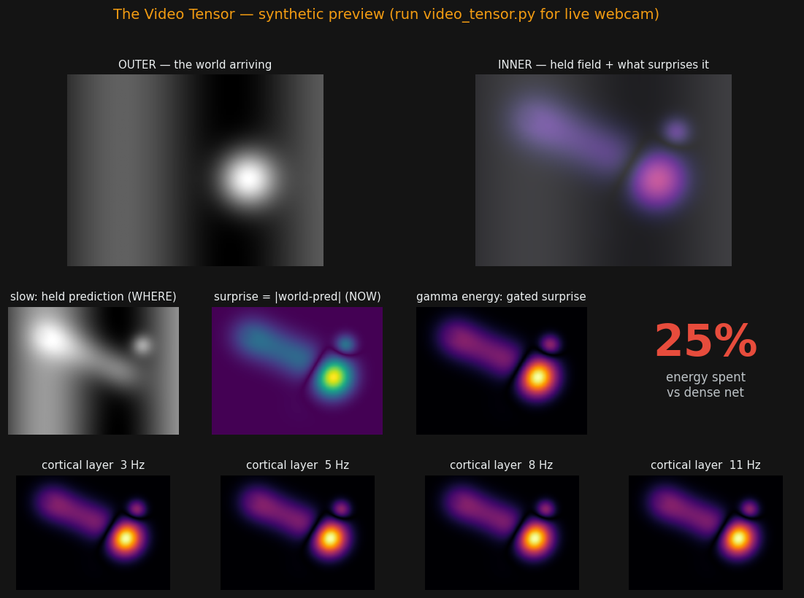

# The Video Tensor

### The cortical tensor pointed at a live webcam — inner/outer views and the cortical-layer stack, with the energy meter reading how little it spends on a still room

**PerceptionLab / Antti Luode, with Claude (Opus 4.8); first video build by Gemini. Helsinki, June 2026.**

> Do not hype. Do not lie. Just show.

---

## The one idea

[`the_tensor`](../the_tensor) proved the energy-on-surprise + theta-gating math on a synthetic field. This points the same field at 30 fps of messy reality. A **slow layer** holds a leaky prediction of the room (`pred ← (1−K)·pred + K·world` — the buffer's `K` as a spatial hold); a **fast layer** is the residual `surprise = |world − pred|`; a **theta clock** gates the broadcast; **gamma** is the gated surprise, the energy actually spent. Sit still and the prediction locks onto the room, the residual collapses, and the field goes dark. Move, and it lights up *only* where the prediction broke — and that lit patch **breathes** at the theta rate.

What's new in this build over the first version: full-size panels (not thumbnails), an **inner vs outer** pair (the raw world vs the model's internal state — the held field with surprise flaring on top), and the **cortical stack** — the same surprise read through several band clocks, the Z-axis made visible. A synthetic fallback runs the whole thing without a webcam.



*(synthetic preview — run `video_tensor.py` for the live webcam version)*

---

## Run it

```bash
pip install opencv-python numpy pillow
python video_tensor.py
```

No webcam? It falls back to a synthetic moving-blob world so the dynamics still show. Sliders: slow-hold `K`, theta Hz, surprise threshold. "Reset prediction (amnesia)" wipes the held room so you can watch it re-learn.

**What to watch.** Sit still ~3 s: the *gamma* panel goes black and the energy bar plunges toward the sensor-noise floor. Wave a hand in one corner: the gamma panel lights an inferno *only* there, the rest stays cheap. Look closely at the lit patch — it pulses; that's the theta gate. The energy bar is the whole argument: a dense net pays 100% (every pixel, every frame); this pays only for what it didn't predict.

---

## The honest ledger

**Verified in code (headless, on synthetic video — `VideoTensorCore`, the GUI's pure-numpy core):**
- a moving blob concentrates gamma **~13× on the motion vs the background**, with only ~11% of pixels active (the rest free);
- gamma amplitude tracks the theta gate at **corr ≈ 0.996** — the PAC breathing is real in the field;
- a perfectly still input sits at ~0% (its residual is zero from the first frame); on a real webcam the floor is sensor noise and movement is the spike.

**Not run here, stated plainly:** the **GUI and webcam were not executed in this environment** (no camera, no display). The field *core* is tested above; the GUI is a thin, careful wrapper around that same verified core, to be run on your machine.

**Honest limits:**
- the "slow predictor" is a leaky per-pixel hold (the buffer's `K`), **not** the full Koopman/U-Net of the HKT repos — chosen so it runs at 30 fps on a CPU. It proves the *economics*, not the heavy perception;
- at video frame rate the resolvable clocks are theta/alpha (≈3–12 Hz); true gamma is sub-frame, so "gamma" here is a **label** for the gated fast residual, and the stack bands are the slow rhythms;
- "energy %" is the **active-pixel fraction** above a surprise threshold — a defensible proxy for what a sparse system would recompute, **not** Joules; the dense baseline is the trivial "process every pixel" 100%;
- the **inner** panel is a render of the model's internal state. Calling it *qualia* is Antti's word; whether it is **felt** is the bet, and it stays in the drawer.

**The point it makes:** a system that *expects* the world spends compute in proportion to its surprise, live, where a dense network spends the same on a blank wall as on a moving hand. That economics is real and watchable. It is not a benchmark and not a claim about the brain.

---

## Lineage

The live instance of [`the_tensor`](../the_tensor), wiring the leaky predictor of [`the_buffer`](../../) and the theta clock of the HKT line onto a webcam. The first `video_tensor.py` was drafted by Gemini; this build fixes the layout, adds the inner/outer and cortical-stack views, factors out a testable core, and verifies that core headlessly. Framing by Antti Luode; built with Claude (Opus 4.8). MIT.

*Hold the room, and stop paying for it. Spend only on the hand that moved — and only when the clock says so. Do not hype. Do not lie. Just show.*
